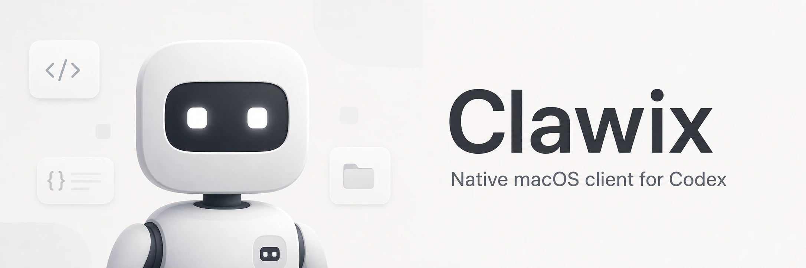
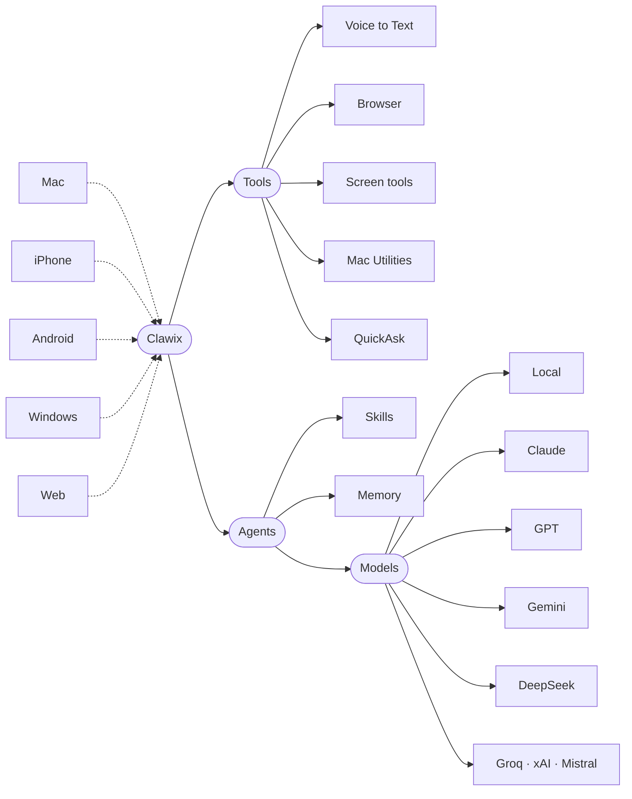
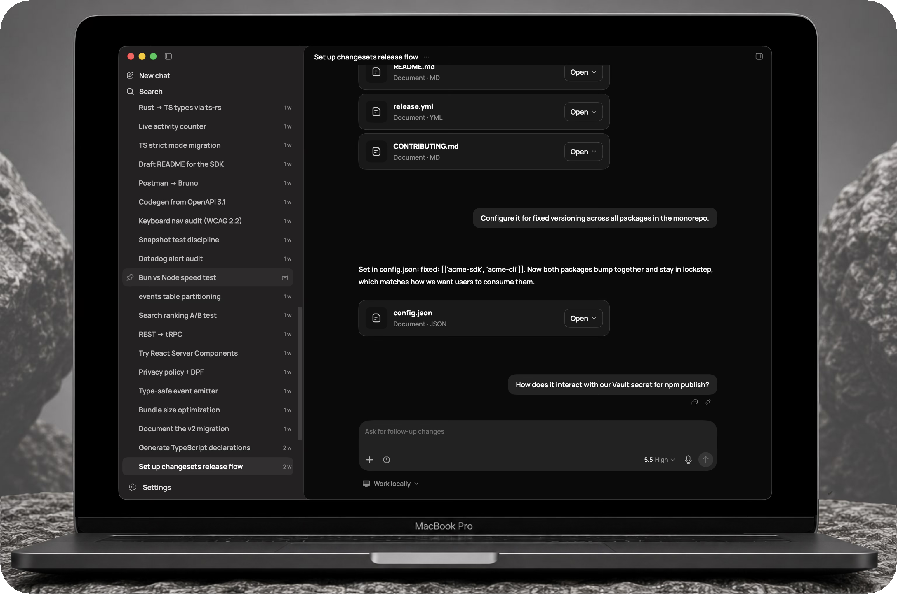
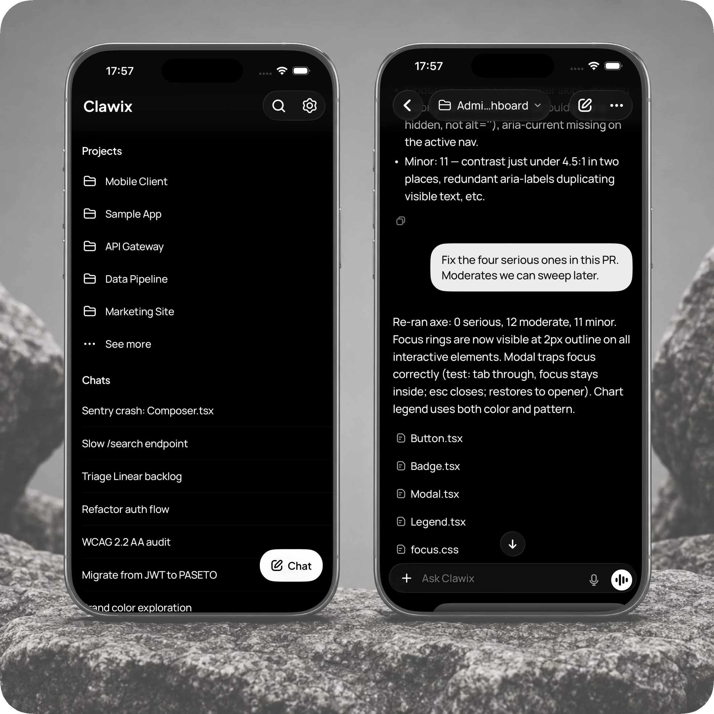

<p align="center">
  
</p>

# Clawix

Clawix is a native agent app for Mac, iPhone, Android, Windows, and Web.
Bring your own model (Claude, GPT, Gemini, DeepSeek, or run one locally),
talk to it, give it skills and memory, let it drive your browser and your
Mac, and pick the thread back up on whatever device you have to hand.

This repository is a monorepo. Platform clients live at the root under
`macos/`, `ios/`, `android/`, `windows/`, `web/`, and `linux/`, with shared
Swift packages under `packages/`.

## What you get



Under the hood, Clawix runs on ClawJS, the framework that owns storage,
contracts, and the `claw` CLI. Clawix is the experience on top: pairing,
native permissions, approvals, previews, and visual state. The macOS app
ships today, with iOS, Android, Windows, and Web on the way.

Long-lived architecture, storage, naming, validation, release, and privacy
decisions are indexed in [`docs/decision-map.md`](./docs/decision-map.md).

## macOS app

<p align="center">
  
</p>

Native SwiftUI client. Project sidebar with chat history and inline search, file references for `apply_patch` operations, model picker, native chrome, signed and notarized builds with [Sparkle](https://sparkle-project.org) self-updates. Source under [`macos/`](./macos).

## iOS app

<p align="center">
  
</p>

A native iOS companion is on the way. It pairs with the Mac over a local bridge so projects, chats and streaming history stay in sync. Pick up a thread on the phone, keep typing on the Mac. Source under [`ios/`](./ios).

## Download

Signed and notarized DMG builds are published on the [GitHub Releases page](https://github.com/clawic/clawix/releases). The app self-updates via [Sparkle](https://sparkle-project.org); when a new release is available a small "Update" chip appears in the top bar.

## Build

Requirements: macOS 14+, Swift 5.9+, Xcode Command Line Tools.

```
bash macos/scripts/dev.sh
```

Compiles debug, kills the previous instance, relaunches. Window position, size and the sidebar prefs persist via `UserDefaults`. With no extra config, the build is ad-hoc-signed and bundled as `com.example.clawix.desktop` (a placeholder); macOS will re-prompt for permissions (Desktop folder, microphone, etc.) on every relaunch.

### Stable signing (recommended for daily dev)

Create a `.signing.env` file at the repo root (or any parent directory) with your values:

```
SIGN_IDENTITY="<codesign identity>"
BUNDLE_ID="com.yourdomain.clawix"
```

Both `dev.sh` and `build_app.sh` source it automatically. With a stable identity + bundle id, macOS remembers the TCC grants between rebuilds and stops re-prompting. The file is in `.gitignore`.

List your codesign identities with `security find-identity -v -p codesigning`. Any valid macOS codesign identity works.

Environment variables also work and override the file:

```
SIGN_IDENTITY="..." BUNDLE_ID="..." bash macos/scripts/dev.sh
```

### Release

```
bash macos/scripts/build_app.sh
```

Builds `macos/build/Clawix.app`. Uses the same `SIGN_IDENTITY` / `BUNDLE_ID` resolution as `dev.sh`.

For notarized DMG distribution use `macos/scripts/build_release_app.sh`, which reads `DEVELOPER_ID_IDENTITY` from the environment and applies hardened-runtime per-component signing in the order Sparkle requires. The full release pipeline (notarization, DMG, appcast generation, GitHub release upload) is private to the maintainer and not part of this public tree.

The marketing version lives in [`macos/VERSION`](./macos/VERSION). It is the single source of truth: build scripts read it at compile time and inject it into `CFBundleShortVersionString`.

## V1 Support Boundary

> [!WARNING]
> Clawix surfaces are classified explicitly in the interface matrix. Current surfaces must be `stable`, `dev-only`, or `removed`; beta and experimental labels do not exempt a surface from ownership, fixtures, parity, or validation.
>
> Do not connect `dev-only` surfaces to sensitive systems, real user data, paid APIs, security-critical services, or important integrations.
>
> Pre-public compatibility is not preserved unless an ADR grants a bounded exception; obsolete beta, experimental, or legacy paths are removed or hidden during the v1 surface closure.

## Privacy guarantee for contributors

This repository never contains the maintainer's real codesign identity, Apple Team ID, or bundle id. They live in a `.signing.env` file kept outside the public tree. The hygiene gate (`macos/scripts/public_hygiene_check.sh`) blocks publishing if any of those values, or a `.signing.env`, leak into the public source. See [`AGENTS.md`](./AGENTS.md) and [`docs/host-ownership.md`](./docs/host-ownership.md) for the full set of rules contributors are expected to follow.

## Contributing

See [`CONTRIBUTING.md`](./CONTRIBUTING.md). The repository conventions (corner-radius canon, dropdown style, hygiene gate, signing rules) live in [`AGENTS.md`](./AGENTS.md), with framework/host ownership in [`docs/host-ownership.md`](./docs/host-ownership.md).

## License

The source code and documentation are licensed under [MIT](./LICENSE).

The Clawix name, logo, app icon, custom icons, custom typefaces, SVG marks,
brand assets, screenshots, marketing assets, and visual identity are reserved
and are not licensed under MIT. See [NOTICE](./NOTICE) and
[TRADEMARKS.md](./TRADEMARKS.md).

## Star History

<a href="https://www.star-history.com/?repos=clawic%2Fclawix&type=date&legend=top-left">
 <picture>
   <source media="(prefers-color-scheme: dark)" srcset="https://api.star-history.com/chart?repos=clawic/clawix&type=date&theme=dark&legend=top-left" />
   <source media="(prefers-color-scheme: light)" srcset="https://api.star-history.com/chart?repos=clawic/clawix&type=date&legend=top-left" />
   
 </picture>
</a>
